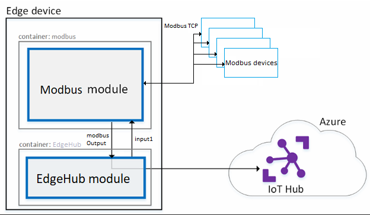

This project has adopted the [Microsoft Open Source Code of Conduct](https://opensource.microsoft.com/codeofconduct/). For more information see the [Code of Conduct FAQ](https://opensource.microsoft.com/codeofconduct/faq/) or contact [opencode@microsoft.com](mailto:opencode@microsoft.com) with any additional questions or comments

# Azure IoT Edge Modbus Module Preview #
Using this module, developers can build Azure IoT Edge solutions with Modbus TCP connectivity. The Modbus module is an [Azure IoT Edge](https://github.com/Azure/iot-edge) module, capable of reading data from Modbus devices and publishing data to the Azure IoT Hub via the Edge framework. Developers can modify the module tailoring to any scenario.

If you are using V1 version of IoT Edge (previously known as Azure IoT Gateway), please use V1 version of this module, all materials can be found in [V1](https://github.com/Azure/iot-gateway-modbus/tree/master/V1) folder.

Visit http://azure.com/iotdev to learn more about developing applications for Azure IoT.

## Azure IoT Edge Compatibility ##
Current version of the module is targeted for the Azure IoT Edge 1.0 preview version.

## Operating System Compatibility ##
Refer to [Azure IoT Edge](https://github.com/Azure/azure-iot-edge#operating-system-compatibility)

## Hardware Compatibility ##
Refer to [Azure IoT Edge](https://github.com/Azure/azure-iot-edge#hardware-compatibility)

## HowTo Run ##
This section will help you download the module from docker hub, and run it with IoT Edge directly.
  1. Setup [Azure IoT Edge](https://github.com/Azure/azure-iot-edge#setup) with compatible version on your machine.
  2. Follow [this](https://review.docs.microsoft.com/en-us/azure/iot-edge/tutorial-install-iot-edge?branch=release-iot-edge-v2#start-the-iot-edge-runtime) to deploy a custom IoT Edge module.
  3. In the Image field, enter **microsoft/azureiotedge-modbus-tcp:1.0-preview**.
  4. You may also want to provide configuration to the module when it starts, paste the configuration in the desired property field. For more about configuration, see [here](https://github.com/Azure/iot-gateway-modbus#configuration).

## HowTo Build ##
If you prefer to build your own module, use the following script. Dockerfiles are located under [Docker](https://github.com/Azure/iot-gateway-modbus/tree/master/V1) folder, you should be able to find one for your platform.
  1. dotnet add package Microsoft.Azure.Devices.Client -v 1.5.1-preview-003 -s https://www.myget.org/F/aziot-device-sdk/api/v3/index.json
  2. dotnet restore
  3. dotnet build
  4. dotnet publish -f netcoreapp2.0
  5. docker build --build-arg EXE_DIR=./bin/Debug/netcoreapp2.0/publish -t "**name of the docker image**" -f "**path to the docker file**".

## Configuration ##
The Modbus module uses module twin as its configuration.
Here is a sample configuration for your reference.
```json
{
  "SlaveConfigs": {
    "Slave01": {
      "SlaveConnection": "192.168.0.1",
      "Interval": "1500",
      "HwId": "PowerMeter-0a:01:01:01:01:01",
      "Operations": {
        "Op01": {
          "UnitId": "1",
          "StartAddress": "400001",
          "Count": "2",
          "DisplayName": "Voltage"
        },
        "Op02": {
          "UnitId": "1",
          "StartAddress": "400002",
          "Count": "2",
          "DisplayName": "Current"
        }
      }
    },
    "Slave02": {
      "SlaveConnection": "192.168.0.2",
      "Interval": "1500",
      "HwId": "PowerMeter-0a:01:01:01:01:02",
      "Operations": {
        "Op01": {
          "UnitId": "1",
          "StartAddress": "40001",
          "Count": "2",
          "DisplayName": "Voltage"
        },
        "Op02": {
          "UnitId": "1",
          "StartAddress": "40002",
          "Count": "2",
          "DisplayName": "Current"
        }
      }
    }
  }
}
```
Meaning of each field:

* "SlaveConfigs" – Contains one or more Modbus slaves' configuration. In this sample, we have Slave01 and Slave02 two devices:
	* "SlaveConnection" – IPV4 address of the Modbus slave
	* "Interval" – Interval between each read operation (not implement yet)
	* "HwId" – Unique Id for each Modbus slave (user defined)
	* "Operations" – Contains one or more Modbus read requests. In this sample, we have Op01 and Op02 two read requests in both Slave01 and Slave02:
		* "UnitId" – The unit id to be read
		* "StartAddress" – The starting address of Modbus read request, currently supports both 5-digit and 6-digit [format](https://en.wikipedia.org/wiki/Modbus#Coil.2C_discrete_input.2C_input_register.2C_holding_register_numbers_and_addresses)
		* "Count" – Number of registers/bits to be read
		* "DisplayName" – Alternative name for the #StartAddress register(s)(user defined)

For more about Modbus, please refer to the [Wiki](https://en.wikipedia.org/wiki/Modbus) link.

## Module Endpoints and Routing ##
All telemetry are sent out from modbusOutput endpoint by default. Routing is enabled by specifying rules like below.
### Route to IoT Hub ###
```json
{
  "modbusToIoTHub":"FROM /messages/modules/modbus/outputs/modbusOutput INTO $upstream"
}
```
### Route to other (filter) modules ###
```json
{
  "modbusToFilter":"FROM /messages/modules/modbus/outputs/modbusOutput INTO BrokeredEndpoint(\"/modules/filtermodule/inputs/input1\")"
}
```
### Write to Modbus ###
Modbus module also has an input enpoint to receive message/commands. Currently it supports writing back to a single register/cell in a Modbus slave. The content of command must be the following format.
```json
{
	"HwId":"PowerMeter-0a:01:01:01:01:01",
	"UId":"1",
	"Address":"40001",
	"Value":"15"
}
```
The command should have a property "command-type" with value "ModbusWrite". Also, routing must be enabled by specifying rule like below.
```json
{
  "filterToModbus":"FROM /messages/modules/filtermodule/outputs/output1 INTO BrokeredEndpoint(\"/modules/modbus/inputs/input1\")"
}
```

## Debug ##
There is a flag **IOT_EDGE** at the first line in Program.cs, which can be turn off to debug the Modbus module in console mode. Note: running in console mode means none of the IoT Edge features is available.
This mode is only to debug non edge-related functions.