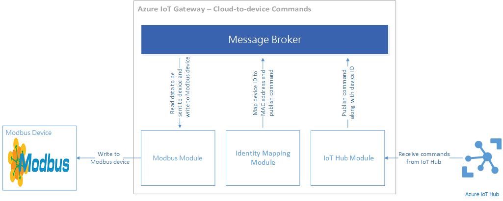

# Modbus Sample for Azure IoT Gateway SDK #

## Overview ##

This sample showcases how one can build an IoT gateway that interacts with 
Modbus devices using the Azure IoT Gateway SDK. The sample contains the following modules:

  1. A Modbus module that interfaces with a Modbus TCP/RTU device to
     read data.
  2. A logger module for diagnostics.
  3. An identity mapping module for translating between Modbus device MAC addresses
     and Azure IoT Hub device identities.
  4. An IoT Hub module for uploading Modbus telemetry data and for receiving
     device commands from the Azure IoT Hub.

##  How the data flows through the Gateway ##

The telemetry upload data flow pipeline is best described via a block diagram:


Here's the journey that a piece of telemetry data takes originating from a Modbus
device before finding its way to an Azure IoT Hub.

  1. The Modbus device generates a data set and transfers it over
     Modbus TCP/RTU to the Modbus module.
  2. The Modbus module receives the data and publishes it on to the message broker
     along with the device's MAC address.
  3. The identity mapping module picks up this message from the message broker and
     looks up its internal table in order to translate the device MAC address 
     into an Azure IoT Hub identity (comprised of a device ID and device key). 
     It then proceeds to publish a new message on to the message broker containing 
     the sample data, the MAC address, the IoT Hub device ID and
     key.
  4. The IoT Hub module then receives this message from the identity
     mapping module and publishes it to the Azure IoT Hub itself.
  5. The logger module logs all messages from the Modbus module into a file on
     the disk.

The cloud to device command data flow pipeline is described via a block diagram
below:



  1. The IoT Hub module receives a new command message from IoT Hub and it
     publishes it to the message broker.
  2. The Identity Mapping module picks up the message and translates the Azure
     IoT Hub device ID to a device MAC address and publishes a new message to
     the message broker including the MAC address in the message's properties map.
  3. The Modbus module then picks up this message and executes the Modbus write 
     operation by communicating with the Modbus device.

## Building the sample ##

The [devbox setup](./devbox_setup.md) guide has information on how you can build the
module.

## Preparing your Modbus device ##

The Modbus devices can be connected to the Modbus module via either Modbus TCP 
or Modbus RTU. Simply filled in the ipv4 address (XXX.XXX.XXX.XXX) or COM# to the 
Modbus module configuration.

## Running the sample ##

In order to bootstrap and run the sample, you'll need to configure each module
that participates in the gateway. This configuration is provided as JSON. All
4 participating modules will need to be configured. There are sample JSON files
provided in the repo called `modbus_win.json` and `modbus_win.json` which you can 
use as a starting point for building your own configuration file. You should find 
the file at the path `samples/modbus/src` relative to the root of the repo.

In order to run the sample you'll run the `modbus_sample` binary passing the
path to the configuration JSON file.

```
modbus_sample <<path to the configuration JSON>>
```

Template configuration JSONs are given below for all the modules that are a part
of this sample.

### Linux

#### Logger configuration

```json
{
    "name": "logger",
    "loader": {
        "name": "native",
        "entrypoint": {
            "module.path": "../../modules/logger/liblogger.so"
        }
    },
    "args": {
        "filename": "log.txt"
    }
}
```

#### Modbus module configuration

```json
{
    "name": "modbus_read",
    "loader": {
        "name": "native",
        "entrypoint": {
            "module.path": "../../modules/modbus_read/libmodbus_read.so"
        }
    },
    "args": [
        {
            "serverConnectionString": "COM1",
            "interval": "2000",
            "macAddress": "01:01:01:01:01:01",
            "deviceType": "powerMeter",
            "operations": [
                {
                    "unitId": "1",
                    "functionCode": "3",
                    "startingAddress": "1",
                    "length": "5"
                }
            ]
        }
    ]
}
```

#### IoT Hub module

```json
{
    "name": "IoTHub",
    "loader": {
        "name": "native",
        "entrypoint": {
            "module.path": "../../modules/iothub/libiothub.so"
        }
    },
    "args": {
        "IoTHubName": "YOUR IOT HUB NAME",
        "IoTHubSuffix": "YOUR IOT HUB SUFFIX",
        "Transport": "TRANSPORT PROTOCOL"
    }
}
```

### Identity mapping module configuration

```json
{
    "name": "mapping",
    "loader": {
        "name": "native",
        "entrypoint": {
            "module.path": "../../modules/identitymap/libidentity_map.so"
        }
    },
    "args": [
        {
            "macAddress": "01:01:01:01:01:01",
            "deviceId": "YOUR DEVICE ID",
            "deviceKey": "YOUR DEVICE KEY"
        }
    ]
}
```

### Windows ##

#### Logger configuration

```json
{
    "name": "logger",
    "loader": {
        "name": "native",
        "entrypoint": {
            "module.path": "..\\..\\..\\modules\\logger\\Debug\\logger.dll"
        }
    },
    "args": {
        "filename": "log.txt"
    }
}
```

#### Modbus module configuration

```json
{
    "name": "modbus_read",
    "loader": {
        "name": "native",
        "entrypoint": {
            "module.path": "..\\..\\..\\modules\\modbus_read\\Debug\\modbus_read.dll"
        }
    },
    "args": [
        {
            "serverConnectionString": "127.0.0.1",
            "interval": "2000",
            "macAddress": "01:01:01:01:01:01",
            "deviceType": "powerMeter",
            "operations": [
                {
                    "unitId": "1",
                    "functionCode": "3",
                    "startingAddress": "1",
                    "length": "1"
                }
            ]
        }
    ]
}
```

#### IoT Hub module

```json
{
    "name": "IoTHub",
    "loader": {
        "name": "native",
        "entrypoint": {
            "module.path": "..\\..\\..\\modules\\iothub\\Debug\\iothub.dll"
        }
    },
    "args": {
        "IoTHubName": "YOUR IOT HUB NAME",
        "IoTHubSuffix": "YOUR IOT HUB SUFFIX",
        "Transport": "TRANSPORT PROTOCOL"
    }
}
```

#### Identity mapping module configuration

```json
{
    "name": "mapping",
    "loader": {
        "name": "native",
        "entrypoint": {
            "module.path": "..\\..\\..\\modules\\identitymap\\Debug\\identity_map.dll"
        }
    },
    "args": [
        {
            "macAddress": "01:01:01:01:01:01",
            "deviceId": "YOUR DEVICE ID",
            "deviceKey": "YOUR DEVICE KEY"
        }
    ]
}
```

Links
-----
Links are to specify the message flow controlled by the message broker.
```json
  "links": [
    {
      "source": "mapping",
      "sink": "IoTHub"
    },
    {
      "source": "IoTHub",
      "sink": "mapping"
    },
    {
      "source": "mapping",
      "sink": "modbus_read"
    },
    {
      "source": "modbus_read",
      "sink": "mapping"
    },
    {
      "source": "modbus_read",
      "sink": "logger"
    }
  ]
```

## Sending cloud-to-device messages ##

The Modbus module also supports sending of instructions from the Azure IoT Hub to
the device. You should be able to use the
[Azure IoT Hub Device Explorer](https://github.com/Azure/azure-iot-sdks/blob/master/tools/DeviceExplorer/doc/how_to_use_device_explorer.md) or the [IoT Hub Explorer](https://github.com/Azure/azure-iot-sdks/tree/master/tools/iothub-explorer)
to craft and send JSON messages that are handled and passed on to the Modbus device
by the Modbus module. For example, sending the following JSON message to the device
via IoT Hub will write value 9999 to the Holding Register 1:

  * Set the value of the Holding Register #1 to 9999.
  * "address" field is the 4-digit decimal address of the destination cell, prefix with the function code, in this case 6 + 0001 = 60001. [More details about address field](https://en.wikipedia.org/wiki/Modbus#Coil.2C_discrete_input.2C_input_register.2C_holding_register_numbers_and_addresses)
  * Function code 6 is "Write Single Holding Register". [Check more function codes](https://en.wikipedia.org/wiki/Modbus#Format_of_data_of_requests_and_responses_for_main_function_codes)

    ```json
    {
      "address": "60001",
      "value": "9999",
      "uid": "1"
    }
    ```

